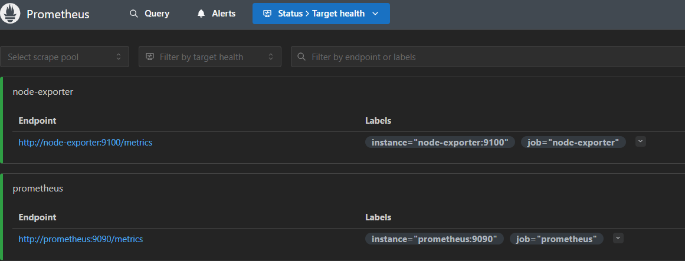
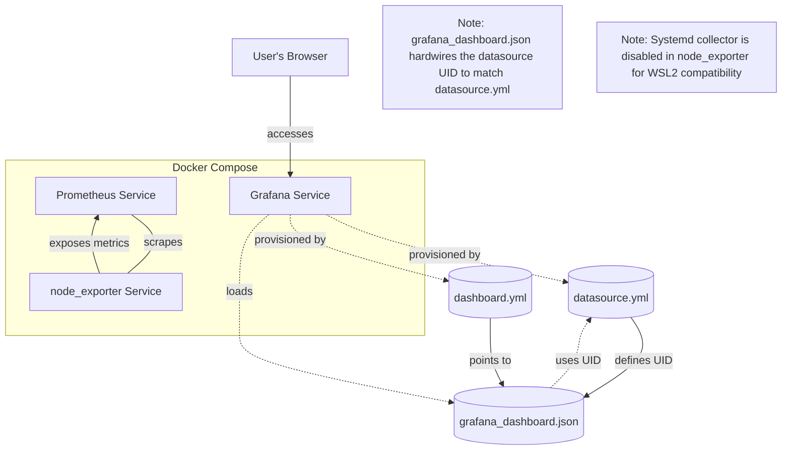
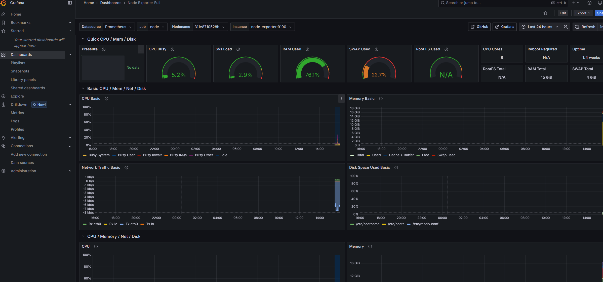

# Understanding Observablity

Goal: Download and use the Node Exporter dashboard created by Graphana for a comprehesive observability of compute resources.

## What Node Exporter Provides

Node Exporter is a Prometheus exporter for hardware and OS metrics exposed by *nix systems. Out of the box, it collects key system-level metrics such as CPU usage, memory, disk I/O, filesystem stats, network stats, load average, and more—without needing custom scripts or agents.

[Learn more on the official GitHub page](https://github.com/prometheus/node_exporter)

## Setup

```bash
curl -o grafana_dashboard.json https://grafana.com/api/dashboards/1860/revisions/40/download
```

[Node Exporter dashboard](https://grafana.com/grafana/dashboards/1860-node-exporter-full/)

## Start

`./up.sh` and in a browser navigate to <[Grafana](http://localhost:3000/login)>

Check Prometheus is up and running at <localhost:9090>


Credentials are  `admin/admin`
> 🪖 Don't do this in prod

The hostnames are valid inside the docker network. Outside, Use localhost.

### promql

**PromQL** (Prometheus Query Language) is the powerful query language used by Prometheus to select and aggregate time series data. It allows you to filter, aggregate, and compute metrics in real time, making it ideal for dashboards and alerting.

- **Basic example:**  

  ```promql
  node_cpu_seconds_total
  ```

  This returns all CPU metrics collected by node_exporter.

- **With filters:**  

  ```promql
  node_cpu_seconds_total{job="node", mode="idle"}
  ```

  This returns only idle CPU seconds for the `node` job.

- **Aggregations:**  

  ```promql
  sum(rate(node_cpu_seconds_total{mode!="idle"}[5m])) by (instance)
  ```

  This shows the per-instance CPU usage rate, excluding idle time.

PromQL is used throughout the dashboard panels to power visualizations and insights.

## Wiring and Architecture



This project uses Docker Compose to orchestrate a complete observability stack with **Prometheus**, **node_exporter**, and **Grafana**. The setup is designed to be reproducible and ready-to-go, avoiding manual dashboard imports ("click ops") by hardwiring configuration and dashboard files.

### Summary

With this architecture, you can clone the repo, run `docker-compose up`, and immediately access a working Grafana dashboard for node_exporter metrics—no manual dashboard import or datasource setup required. All configuration is version-controlled and reproducible.

### Components and File Wiring

- **docker-compose.yml**  
  Defines and runs the following services:
  - **Prometheus**: Scrapes metrics from itself and node_exporter using `prometheus.yml`.
  - **node_exporter**: Exposes host metrics to Prometheus. The `--no-collector.systemd` flag is set to avoid errors on WSL2 or non-systemd environments.
  - **Grafana**: Visualizes metrics using a pre-configured dashboard and datasource.

- **prometheus.yml**  
  Configures Prometheus scrape jobs:
  - Scrapes itself at `prometheus:9090`.
  - Scrapes node_exporter at `node-exporter:9100` with the job name `node`.

- **grafana/provisioning/datasources/datasource.yml**  
  Provisions the Prometheus datasource in Grafana with a fixed UID (`prometheus-ds-uid`). This ensures all dashboard references are consistent and not dependent on manual selection.

- **grafana/provisioning/dashboards/dashboard.yml**  
  Provisions the Node Exporter dashboard automatically at Grafana startup, pointing to the local dashboard JSON file.

- **grafana/dashboards/grafana_dashboard.json**  
  Contains the Node Exporter dashboard definition (downloaded from Grafana.com). 

### Connection between `dashboard.yml` and `datasource.yml`

The `dashboard.yml` file is responsible for telling Grafana which dashboards to automatically load at startup and which datasource to use as the default for those dashboards. It typically references a "provider" (such as `default`) and points to the location of `grafana/dashboards` files.

The `datasource.yml` file provisions datasources for Grafana, such as Prometheus, and can specify which datasource should be the default by setting `isDefault: true`.

**How they connect:**  

- When `dashboard.yml` uses the `default` provider, it means dashboards provisioned through this file will use the datasource marked as default in `datasource.yml` unless a specific datasource is set in [grafana_dashboard.json](grafana/dashboards/grafana_dashboard.json).
- In this setup, Prometheus is set as the default datasource in `datasource.yml` (`isDefault: true`), so any dashboard provisioned via `dashboard.yml` that does not explicitly specify a datasource will use Prometheus by default.
- However, to avoid ambiguity and ensure reproducibility, `grafana_dashboard.json` is hardwired to use the Prometheus datasource UID (`prometheus-ds-uid`), matching what is defined in `datasource.yml`.

This setup ensures that dashboards are always connected to the correct Prometheus datasource, whether or not they rely on the default provider mechanism.

### Key Tweaks for Reproducibility

- **Datasource UID Hardwiring:**  
  Since the dashboard is not imported via the Grafana UI, `${DS_PROMETHEUS}` is replaced in the JSON with the actual UID from `datasource.yml` to ensure the dashboard works out-of-the-box.

- **Variable Mapping:**  
  The `templating` section in the dashboard JSON is updated to use the correct Prometheus datasource UID for all variables (e.g., `job`, `node`), preventing "datasource not found" errors.

- **Systemd Collector Disabled:**  
  The `--no-collector.systemd` flag is added to node_exporter in `docker-compose.yml` to avoid errors on WSL2 or other environments without systemd.

> **Note:**  
> The environment variable in `docker-compose.yml` is unused.  
> It is left here as a reminder that it does **not** work for wiring the Prometheus datasource UID into the Grafana dashboard.  
> Instead, you must replace `${DS_PROMETHEUS}` in the dashboard JSON with the actual UID from `datasource.yml` as described above.


## How do I know if the node exporter dashboard is wired right?

You should see a working dashboard similar to this:


## What's weird?

1. Variables in dashboard.json
    node exporter uses environment variable `"uid": "${DS_PROMETHEUS}"`.
    The node exporter dashboard does not read correctly from the prometheus datasource.  
    *The `${DS_PROMETHEUS}` variable in Grafana dashboard JSON is replaced only when you import the dashboard through the Grafana UI or API and select a Prometheus datasource. Grafana automatically substitutes this variable with the selected datasource's UID during the import process.*  
    Since we would like to have this dashboard ready to go, we will replace all occurunces of `${DS_PROMETHEUS}` with the actual datasource uid from  [datasource.yml](grafana/provisioning/datasources/datasource.yml)

    ```bash
    sed -i 's/\${DS_PROMETHEUS}/prometheus-ds-uid/g' /home/epsilon/projects/observability_tutorial/grafana/dashboards/grafana_dashboard.json
    ```

    Also the datasource uid mapping was incorrect in the templating section, replace that to `prometheus-ds-uid` to match whats in [datasource.yml](grafana/provisioning/datasources/datasource.yml)

    ```json
      "templating": {
    
      {
        "current": {},
        "datasource": {
          "type": "prometheus",
          "uid": "prometheus-ds-uid"
        },
    ```

2. Systemd metrics on wsl2

    ```bash
    node-exporter-1  | time=2025-05-26T19:28:55.405Z level=ERROR source=collector.go:168 msg="collector failed" name=systemd duration_seconds=5.5574e-05 err="couldn't get dbus connection: dial unix /var/run/dbus/system_bus_socket: connect: no such file or directory"
    ```

    In docker-compose.yml, disable systemd metrics

    ```bash
    --no-collector.systemd
    ```
