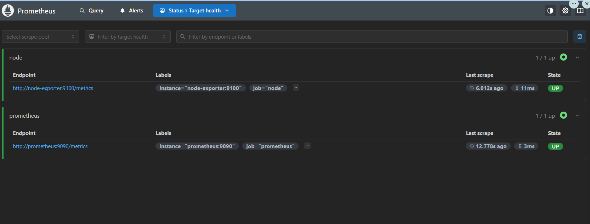

# Understanding Observablity

Initial outline

## Setup

```bash
curl -o grafana_dashboard.json https://grafana.com/api/dashboards/1860/revisions/40/download
```

[Node Exporter dashboard](https://grafana.com/grafana/dashboards/1860-node-exporter-full/)

## Start

`./up.sh` and in a browser navigate to <[Grafana](http://localhost:3000/login)>

Check Prometheus is up and running at <localhost:9090>


Credentials are  `admin/admin`
> 🪖 Don't do this in prod

The hostnames are valid inside the docker network. Outside, Use localhost.

### promql

```sql
    node_cpu_seconds_total
```

## How do I know if the node exporter dashboard is wired right?

You should see a working dashboard similar to this:


## What's weird?

1. Variables in dashboard.json
    node exporter uses environment variable `"uid": "${DS_PROMETHEUS}"`.
    The node exporter dashboard does not read correctly from the prometheus datasource.  
    *The `${DS_PROMETHEUS}` variable in Grafana dashboard JSON is replaced only when you import the dashboard through the Grafana UI or API and select a Prometheus datasource. Grafana automatically substitutes this variable with the selected datasource's UID during the import process.*  
    Since we would like to have this dashboard ready to go, we will replace all occurunces of `${DS_PROMETHEUS}` with the actual datasource uid from  [datasource.yml](grafana/provisioning/datasources/datasource.yml)

    ```bash
    sed -i 's/\${DS_PROMETHEUS}/prometheus-ds-uid/g' /home/epsilon/projects/observability_tutorial/grafana/dashboards/grafana_dashboard.json
    ```

    Also the datasource uid mapping was incorrect in the templating section, replace that to `prometheus-ds-uid` to match whats in [datasource.yml](grafana/provisioning/datasources/datasource.yml)

    ```json
      "templating": {
    
      {
        "current": {},
        "datasource": {
          "type": "prometheus",
          "uid": "prometheus-ds-uid"
        },
    ```

2. Systemd metrics on wsl2

    ```bash
    node-exporter-1  | time=2025-05-26T19:28:55.405Z level=ERROR source=collector.go:168 msg="collector failed" name=systemd duration_seconds=5.5574e-05 err="couldn't get dbus connection: dial unix /var/run/dbus/system_bus_socket: connect: no such file or directory"
    ```

    In docker-compose.yml, disable systemd metrics

    ```bash
    --no-collector.systemd
    ```
